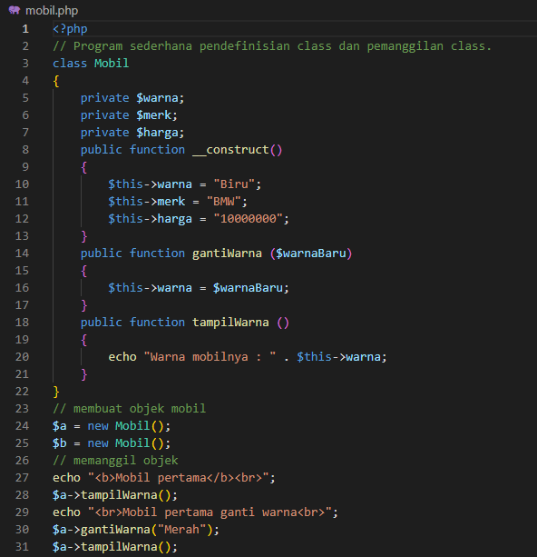
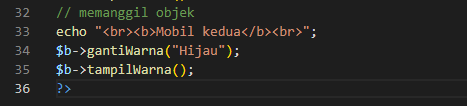
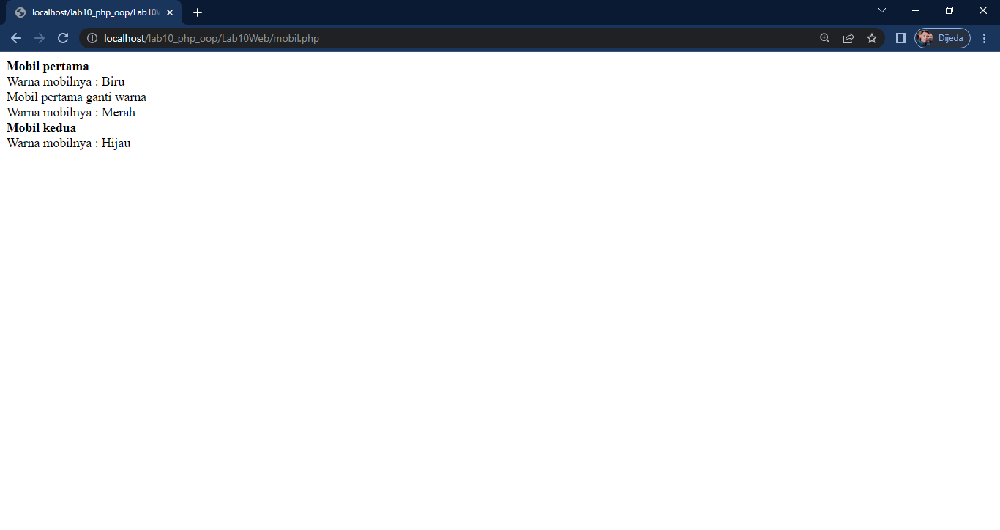
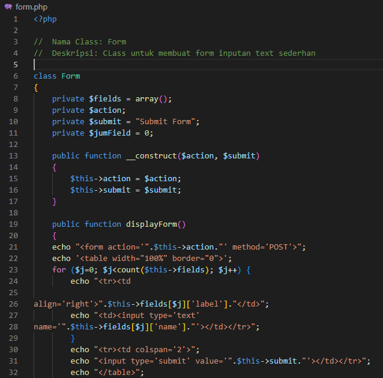
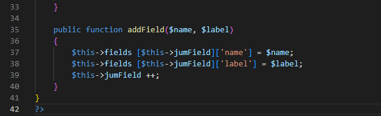
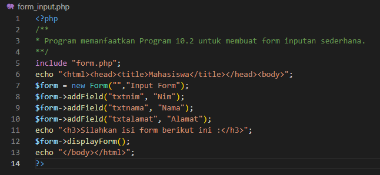
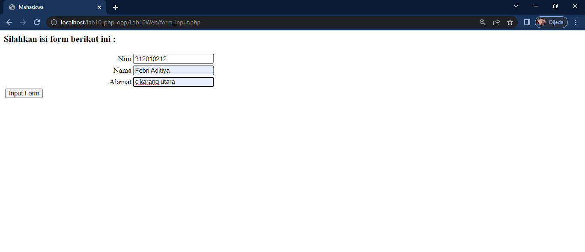

# Lab10Web
Praktikum 10 PHP OOP

#### Langkah-langkah praktikum
Membuat File baru, mobil.php

tampilannya seperti ini

### Lalu membuat File baru lagi dengan nama form.php

### dan buat File lagi dengan nama form_input.php

Dan hasilnya sebagai berikut.

